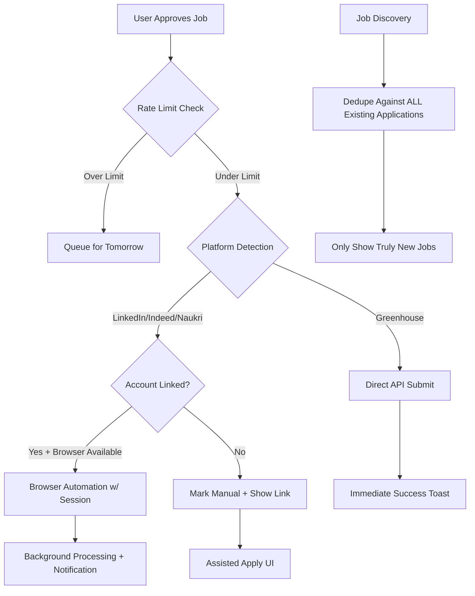

# One-Click Apply Engine — Implementation Plan

**Created:** 2026-06-02  
**Status:** In Progress  
**Goal:** Build the missing one-click apply layer so users can approve jobs and have them actually submitted on their behalf.

---

## Problem Statement

Applyo's core value prop is "Upload your resume once. Apply everywhere." But today:

1. **Duplicate suggestions** — Jobs keep re-appearing in the suggestion/approval queue even after being approved, skipped, or applied.
2. **Nothing happens on approve** — When a user clicks "Approve", the job disappears from the queue but no actual application is submitted. Automation silently fails or marks as manual without clear user feedback.
3. **No account context** — The system can't apply on behalf of the user because it has no access to their platform accounts (LinkedIn, Indeed, Naukri).

---

## Requirements

- Fix deduplication: once a job is approved/skipped/applied, it NEVER appears in suggestions again
- Implement Greenhouse direct API submission (no browser needed — guest forms)
- Add platform account-linking (session/OAuth) for LinkedIn, Indeed, Naukri
- Provide immediate feedback on approval (toast) + background notifications for slow browser jobs
- Respect `max_applications_per_day` from user preferences
- Rate-limit apply attempts to avoid platform detection

---

## Research Findings (June 2026)

### Greenhouse — ✅ Direct API (No Auth Needed)

- **Endpoint:** `POST https://boards-api.greenhouse.io/v1/boards/{board_token}/jobs/{id}`
- **Auth:** HTTP Basic Auth with the board's Job Board API Key (Base64 encoded). No user credentials needed.
- **Content:** Accepts multipart/form-data OR application/json
- **Fields:** first_name, last_name, email, phone, resume (file), cover_letter_text, custom question answers
- **Validation:** first_name, last_name, email required. Resume must be pdf/doc/docx/txt/rtf.
- **Questions:** Fetch via `GET .../jobs/{id}?questions=true` to get dynamic form fields
- **Status:** Active and documented as of 2026. Public API, no partnership required.

### LinkedIn — ❌ No Public Apply API

- **Apply Connect API** exists but is ATS-partner-only (requires LinkedIn Talent Solutions partnership approval)
- **"Apply with LinkedIn" plugin** is for employers to add to their sites, not for submitting on behalf of users
- **Only viable path:** Browser automation with user's authenticated session cookies
- **Risk:** LinkedIn actively detects automation; requires careful rate limiting and human-like delays

### Indeed — ❌ No Public Apply API

- **Send Candidates API** (2026) exists but is for ATS integration partners only
- **Indeed Apply** flow is employer-facing (receives applications, doesn't submit them)
- **Only viable path:** Browser automation with user's authenticated session
- **Note:** Indeed often redirects to external company sites, making automation unreliable

### Naukri — ❌ No API

- No public API of any kind for job applications
- **Only viable path:** Browser automation with Selenium/Playwright + user session cookies
- **Community:** Multiple open-source Naukri auto-apply bots exist (Selenium-based)
- **Risk:** Naukri has basic bot detection but less sophisticated than LinkedIn

---

## Architecture



---

## Task 1: Fix Deduplication

**Objective:** Guarantee that once a job enters the applications table (in ANY status), it is never suggested again.

**Changes:**

1. **`lib/services/match-service.ts`** — In `generateMatchesForCandidate`:
   - Fetch ALL existing application job_ids for the candidate (all statuses)
   - Only upsert for jobs NOT already in the applications table
   - Never overwrite a non-pending status back to pending

2. **`lib/services/basic-matching.ts`** — In `getSuggestedJobsForCandidate`:
   - The existing query already fetches all applications (no status filter) — verify this is correct
   - Ensure the `handledJobIds` set is passed to `dedupeSuggestedJobs`

3. **`lib/db/applications.ts`** — In `upsertApplication`:
   - Before upserting, check if an existing application has a non-pending status
   - If yes, skip the upsert (don't overwrite approved/skipped/applied/failed)

**Test:** Create a candidate with applied/skipped jobs → run discovery → confirm those jobs don't resurface.

---

## Task 2: Greenhouse Direct API Submission

**Objective:** Submit applications directly via Greenhouse's REST API without needing a browser.

**New file: `lib/automation/platforms/greenhouse-api-apply.ts`**

- Parse `board_token` and `job_id` from URLs like `boards.greenhouse.io/{board_token}/jobs/{id}`
- Fetch job questions: `GET https://boards-api.greenhouse.io/v1/boards/{board_token}/jobs/{id}?questions=true`
- Map candidate resume data to standard fields (first_name, last_name, email, phone)
- Use AI to answer custom questions based on resume + job description
- Submit via `POST` with multipart/form-data including resume file upload
- Handle GDPR consent fields if present in questions

**Router update:**
- In `router.ts`: detect Greenhouse URLs → call API apply FIRST (no browser needed)
- Mark Greenhouse direct-URL jobs as auto-apply-ready even without `BROWSER_WS_ENDPOINT`

**Test:** Verify correct payload construction against Greenhouse API spec.

---

## Task 3: Platform Account Linking Infrastructure

**Objective:** Allow users to connect platform accounts for authenticated browser automation.

**New migration: `supabase/migrations/009_platform_accounts.sql`**
```sql
CREATE TABLE platform_accounts (
  id uuid PRIMARY KEY DEFAULT gen_random_uuid(),
  candidate_id uuid REFERENCES candidates(id) ON DELETE CASCADE NOT NULL,
  platform text NOT NULL CHECK (platform IN ('linkedin', 'indeed', 'naukri')),
  credentials_encrypted text NOT NULL,
  status text NOT NULL DEFAULT 'active' CHECK (status IN ('active', 'expired', 'revoked')),
  linked_at timestamptz DEFAULT now() NOT NULL,
  expires_at timestamptz,
  UNIQUE (candidate_id, platform)
);
```

**New service: `lib/services/platform-accounts.ts`**
- Encrypt/decrypt credentials using AES-256-GCM with `PLATFORM_CREDENTIALS_KEY` env var
- CRUD operations: link, get, update status, delete

**New API: `app/api/candidate/platform-accounts/route.ts`**
- GET: list linked accounts (without exposing credentials)
- POST: link a new account (encrypt and store)
- DELETE: unlink an account

**UI:** Add "Connect Accounts" section in Preferences tab.

---

## Task 4: Browser Automation with Linked Accounts

**Objective:** Use stored credentials to authenticate browser sessions before apply automation.

**New file: `lib/automation/session-injector.ts`**
- Accept platform account credentials (decrypted)
- Inject session cookies into Playwright browser context before navigation
- Validate session is still active (check for login wall after navigation)

**Router updates:**
- Before launching browser automation, check if candidate has a linked account for the platform
- If linked + browser available → inject session → run automation
- If linked but session expired → mark account as expired, mark application as failed
- If not linked → mark as manual

---

## Task 5: Immediate Feedback & Real-time Status

**Objective:** Give users instant visibility into what happens when they approve a job.

**Changes:**

1. **`/api/approvals` POST response** — Include `apply_method` field:
   - `'api_direct'` — Greenhouse API (awaited inline, immediate result)
   - `'browser_queued'` — Browser automation started in background
   - `'manual'` — Needs manual apply

2. **For Greenhouse API:** Await the submission inline within the approval handler. Return success/failure immediately.

3. **Frontend toasts (ApprovalQueueCard.tsx):**
   - Green: "✓ Application submitted to {company}!"
   - Blue: "⏳ Applying in background... we'll notify you"
   - Amber: "📋 Moved to assisted apply — open source link to apply manually"

4. **ApplicationRow.tsx:** Poll `/api/applications` for status changes on in_progress items.

---

## Task 6: Daily Rate Limiting

**Objective:** Respect user's `max_applications_per_day` and throttle to avoid detection.

**New file: `lib/automation/rate-limiter.ts`**
- `getDailyUsage(candidateId)` — count applications with `applied_at` today
- `canApplyToday(candidateId)` — compare usage vs preference limit
- `getRemainingQuota(candidateId)` — return slots left

**Integration:**
- Check rate limit before each automation attempt in `triggerApply`
- If over limit, set status to `queued` (not failed) with message "Daily limit reached"
- "Approve All" respects limit: only process up to remaining quota
- Inter-application delay: random 30-90s between browser automation attempts
- Show remaining quota in dashboard overview

---

## Task 7: End-to-End Integration

**Objective:** Wire everything together with proper error recovery.

**Changes:**

1. **Updated `triggerApply` flow:**
   ```
   Check rate limit → Detect platform → Choose method (API/browser/manual) → Execute → Update status
   ```

2. **Retry logic:** Failed automation retries once after 5 minutes (simple delayed re-trigger via setTimeout or queued job)

3. **`automation_method` tracking:** Add column to applications table:
   - `'api'` — Submitted via direct API (Greenhouse)
   - `'browser'` — Submitted via browser automation
   - `'manual'` — User applied manually and marked it

4. **Error recovery:**
   - Session expired → mark account as expired, notify user to re-link
   - Browser timeout → retry once, then mark as failed with actionable message
   - API rejection → parse error, show to user (e.g., "Position no longer accepting applications")

5. **ApplicationRow display:** Show method badge ("Via API" / "Via Automation" / "Manual")

---

## Execution Order

1. ✅ Task 1 (Deduplication) — fixes the most annoying user-facing bug
2. Task 2 (Greenhouse API) — delivers real one-click apply for a subset of jobs
3. Task 3 (Account Linking) — infrastructure for browser-based platforms
4. Task 4 (Session Injection) — enables LinkedIn/Indeed/Naukri automation
5. Task 5 (Feedback) — makes the UX feel alive
6. Task 6 (Rate Limiting) — safety and compliance
7. Task 7 (Integration) — polish and error handling

---

## Environment Variables (New)

```env
# Platform account encryption
PLATFORM_CREDENTIALS_KEY=your-32-byte-hex-key

# Greenhouse (optional — for boards that require specific API keys)
GREENHOUSE_API_KEY=your-greenhouse-job-board-api-key
```

---

*Last updated: 2026-06-02*
